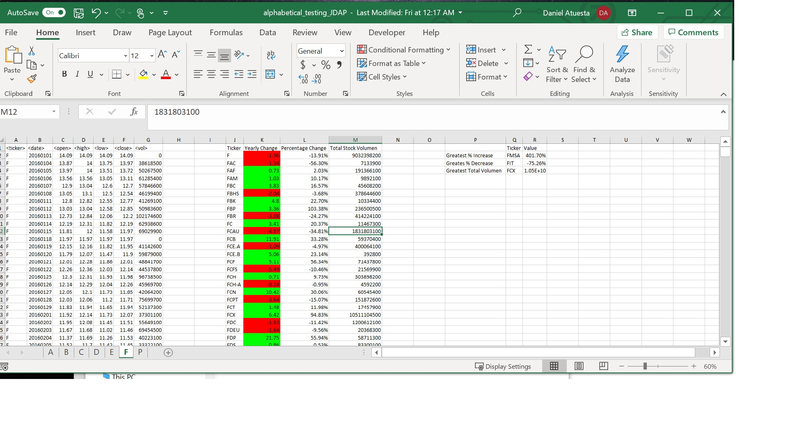
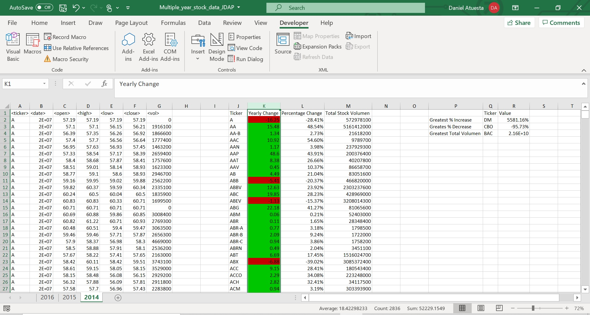
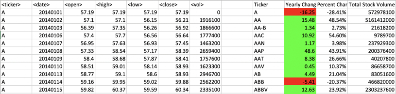

# VBA-Challange-JDAP

## VBA Homework - The VBA of Wall Street

### Intention of the Repository

This Repository has been made to summit the homework assignment for my Data Science Bootcamp at Northwestern University

VBA Scripting

Student: Jorge Daniel Atuesta

February, 2021

---

### What you will find in this Repository

On the following repository the reader will be able to find my solution to the homework assignment VBA scripting. The repository is organized into several folders:

1. Folder one will have Images that are related to the readme.md class instructions. You can avoid navigating this folder
2. Folder two will have the screenshots for the solutions. Inside this folder you will have two other folders each one containing the screenshots of the Alphabetical testing results and the Multi Yearly Stock Data.
3. Folder three contains all the VBA scripts used for both the alphabetical testing and the Multi Yearly Stock Data. They are essentially the same code what changes are the Sub () name.

I hope you find my work to not only be complete but displaying all of the knowledge learned throughout this portion of the Data Science Bootcamp at Northwestern University.

---

# Homework Analysis

## Description of the assignment

For this challenge we are using VBA scripting to analyze real stock market data. We have been provided a database with the following information:

* Stock identifier (Ticker)
* Date
* Open amount
* Highest amount
* Lowest amount
* Close date
* Volume of stock

Using VBA scripting out challenges were the following:

1. Loop through all stocks for one year and output the following information on separate columns

   * The ticker symbol.
   * Yearly change from opening price at the beginning of a given year to the closing price at the end of that year.
   * The percent change from the opening price at the beginning of a given year to the closing price at the end of that year.
   * The total stock volume of the stock.
2. Code conditional formatting that will highlight positive change in green and negative change in red.
3. Create a summary table that will show the return of the stock with the "Greatest % increase", "Greatest % decrease" and "Greatest total volume".
4. We must run our code in all worksheets of the workbook just by running the VBA script once.

## Outcomes of the project

### Test Data outcomes

Initially I had to create a VBA script for the trial database. This first script was utilized as a test dummy to see if I was able to solve all the challenges. Here is the VBA script I used for this database:

Here are the results I got after accomplishing all the challanges. The results are shown as screenshots of each worksheet in the test workbook:

During period A, the stock with the greatest percetn increase was AKS. The stock with the greatest percent decrease was ADPT and, the stock with the greatest total volume was AA. 

During period B, the stock with the greatest percetn increase was BAS. The stock with the greatest percent decrease was BCEI and, the stock with the greatest total volume was BAC.

During period C, the stock with the greatest percetn increase was CBO. The stock with the greatest percent decrease was CGG and, the stock with the greatest total volume was CHK.

During period D, the stock with the greatest percetn increase was DRD. The stock with the greatest percent decrease was DYN.W and, the stock with the greatest total volume was DNR.

During period E, the stock with the greatest percetn increase was EBR. The stock with the greatest percent decrease was EMG and, the stock with the greatest total volume was EAC.

During period F, the stock with the greatest percetn increase was FMSA. The stock with the greatest percent decrease was FIT and, the stock with the greatest total volume was FCX.

During period P, the stock with the greatest percetn increase was PANW. The stock with the greatest percent decrease was PWE and, the stock with the greatest total volume was PBR.

### Multi Year Stock Data outcomes

After being able to successfully acomplish the challanges (as shown in the test outcomes tab) I continued to the homeworks assignment database and ran the following VBA script:

Here are the results I got after accomplishing all the challanges. The results are shown as screenshots of each worksheet in the test workbook:

During the year 2014, the stock with the greatest percetn increase was DM. The stock with the greatest percent decrease was CBD and, the stock with the greatest total volume was BAC.

During the year 2015, the stock with the greatest percetn increase was APR. The stock with the greatest percent decrease was KMI.W and, the stock with the greatest total volume was BAC.

During the year 2016, the stock with the greatest percetn increase was SD. The stock with the greatest percent decrease was DYN.W and, the stock with the greatest total volume was BAC.

As you can appreciate I was able to write a VBA script that in a single run was able to loop through all the worksheets in the workbook and complete the challenges mentioned on the description of assignment tab above.

---

# References

In the VBA scripts I placed the links to different webpages I used to be able to accomplish this project. You can also find here a list of the references I used:

Acampora, J. (2015, May 11). *VBA Tutorial: Find the Last Row, Column, or Cell on a Sheet*. Retrieved from Excel Campus: https://www.excelcampus.com/vba/find-last-row-columncell/#:~:text=To%20find%20the%20last%20used,the%20rows%20in%20the%20worksheet.

AutomateExcel. (2021). *Excel VBA: ColorIndex Codes List & RGB Colors*. Retrieved from AutoMateExcel.com: https://www.automateexcel.com/excel-formatting/color-reference-for-color-index/

AutomateExcel. (2021). *VBA Sum Function (Ranges, Columns, & More)*. Retrieved from AutomateExcel.com: https://www.automateexcel.com/vba/sum-function/

ExcelHowTo. (2014, September 11). *Formatting a Range of Cells In Excel VBA*. Retrieved from Excel How To: https://www.excelhowto.com/macros/formatting-a-range-of-cells-in-excel-vba/

**Please note: *I am new to READ.md files and I could not do the proper citation of the references following the APA style***

---

# Assignment instructions provided by Northwestern Data Science Bootcamp

VBA Homework - The VBA of Wall Street

## Background

You are well on your way to becoming a programmer and Excel master! In this homework assignment you will use VBA scripting to analyze real stock market data. Depending on your comfort level with VBA, you may choose to challenge yourself with a few of the challenge tasks.

### Before You Begin

1. Create a new repository for this project called `VBA-challenge`. **Do not add this homework to an existing repository**.
2. Inside the new repository that you just created, add any VBA files you use for this assignment. These will be the main scripts to run for each analysis.

### Files

* [Test Data](Resources/alphabetical_testing.xlsx) - Use this while developing your scripts.
* [Stock Data](Resources/Multiple_year_stock_data.xlsx) - Run your scripts on this data to generate the final homework report.

### Stock market analyst

## Instructions

* Create a script that will loop through all the stocks for one year and output the following information.

  * The ticker symbol.
  * Yearly change from opening price at the beginning of a given year to the closing price at the end of that year.
  * The percent change from opening price at the beginning of a given year to the closing price at the end of that year.
  * The total stock volume of the stock.
* You should also have conditional formatting that will highlight positive change in green and negative change in red.
* The result should look as follows.

### CHALLENGES

1. Your solution will also be able to return the stock with the "Greatest % increase", "Greatest % decrease" and "Greatest total volume". The solution will look as follows:

2. Make the appropriate adjustments to your VBA script that will allow it to run on every worksheet, i.e., every year, just by running the VBA script once.

### Other Considerations

* Use the sheet `alphabetical_testing.xlsx` while developing your code. This data set is smaller and will allow you to test faster. Your code should run on this file in less than 3-5 minutes.
* Make sure that the script acts the same on each sheet. The joy of VBA is to take the tediousness out of repetitive task and run over and over again with a click of the button.

## Submission

* To submit please upload the following to Github:

  * A screen shot for each year of your results on the Multi Year Stock Data.
  * VBA Scripts as separate files.
* Ensure your repository has regular commits (i.e. 10+ commits), a thorough README.md file
* After everything has been saved, create a sharable link and submit that to [https://bootcampspot-v2.com/](https://bootcampspot-v2.com/).

---

### Copyright

Trilogy Education Services © 2019. All Rights Reserved.
